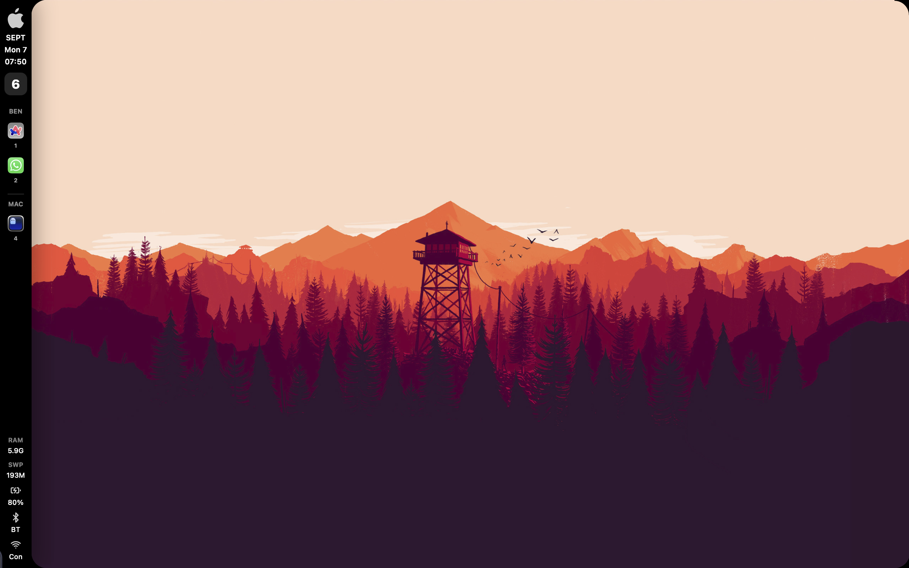
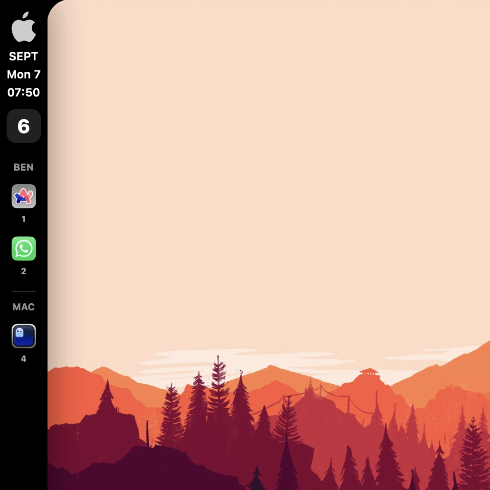
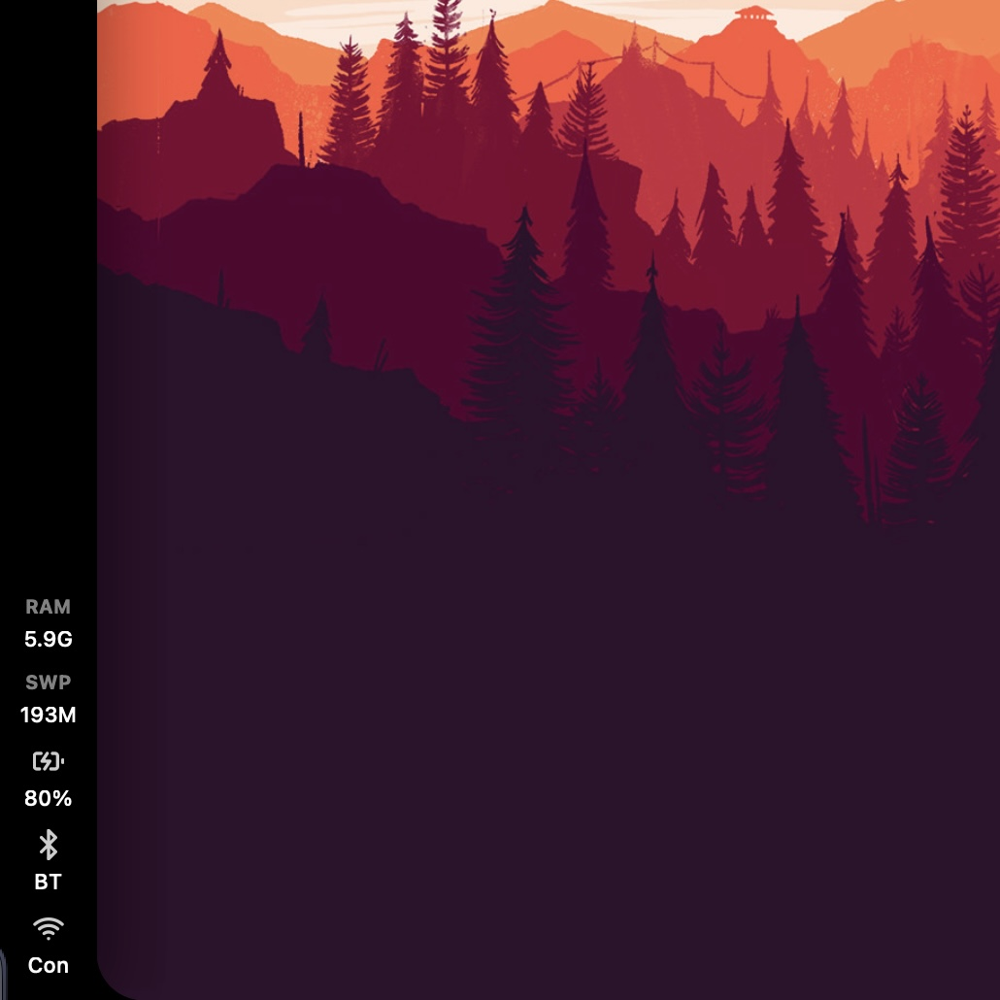

# AeroSpace Sidebar Widget for Ubersicht


A sleek, event-driven, zero-polling workspace widget for [AeroSpace](https://github.com/nikitabobko/AeroSpace) on macOS, built for [Übersicht](https://github.com/felixhageloh/uebersicht). It supports multi-monitor tracking, instant app-icon caching, and has been aggressively optimized to consume virtually 0% idle CPU.




 |  

## ✨ Features
- **AeroSpace Integration**: Instantly tracks workspaces and active windows across multiple monitors.
- **Auto App Icons**: Automatically extracts `.icns` from macOS apps and builds a local `.png` cache on the fly.
- **Ponytail Optimized**: 0% idle CPU. No background React polling. Updates are strictly pushed via OSAScript hooks.
- **Hardware Metrics**: Shows battery level, charging status, Wi-Fi status, and smart audio device detection (Speakers vs AirPods/Headphones).

## 🚀 Installation

1. Install [Übersicht](https://github.com/felixhageloh/uebersicht).
2. Clone this repository into your Übersicht widgets folder:
   ```bash
   cd ~/Library/Application\ Support/Übersicht/widgets/
   git clone https://github.com/GranthikSom/VerticalBar
   ```
   > **Important:** The repository contains a `Sidebar.widget` directory that Übersicht will automatically recognize.

3. Update your `~/.aerospace.toml` config to instantly trigger the widget on workspace or focus changes:
   ```toml
   exec-on-workspace-change = ['bash', '-c', 'exec-and-forget osascript -e "tell application \\"Übersicht\\" to refresh widget id \\"Sidebar-widget-index-jsx\\""']
   on-focus-changed = ['exec-and-forget osascript -e "tell application \\"Übersicht\\" to refresh widget id \\"Sidebar-widget-index-jsx\\""']
   ```

---

## ⚡ The Optimization Architecture

To keep this widget instantaneous, several extreme optimizations were applied. **Do not undo these if you fork.**

### 1. No Background Polling (Event-Driven)
Ubersicht's native polling (`refreshFrequency = 10000`) is completely disabled (`refreshFrequency = false;`). 
Instead, updates are triggered **exclusively** via the AeroSpace OSAScript callbacks above.

### 2. Single-Process Execution
The widget executes exactly **one** shell string (`const CMD = ...`) to gather all data (Workspaces, Windows, Wi-Fi, Audio, Battery). 

### 3. Native V8 Regex Parsing
Instead of using slow `awk`/`sed`/`grep` in bash or expensive `.includes()` chaining in JS, the widget uses raw pre-compiled JavaScript Regular Expressions (`/headphones|external/.test(audioRaw)`). 

### 4. Zero-Block DOM Caching
The widget never relies on `` `onError` handlers, which notoriously block the main React thread. Instead, it reads the `icons/` directory into a global JavaScript `Set()` on startup, and dynamically generates missing icons in the background via `generate_icon.sh`.

### 5. Static Emotion CSS
All `css({...})` function calls have been extracted *outside* of the React `render()` function to bypass Emotion's expensive render-loop object hashing.

---

## 🛠️ Customization

### Moving the Widget
To move the widget to the right side of the screen, open `index.jsx` and look for the `export const className` block at the top. Change `left: "10px"` to `right: "10px"`.

### Adding a New Audio Device (e.g. New AirPods)
If you buy new headphones and they show up as the "Speaker" icon, check the output of `Sidebar.widget/audio_device`. 
Then, open `index.jsx` and add a unique keyword from that output into the regex parser:
```javascript
// Find this line:
} else if (/airpods|bluetooth|bose|sony|beats|buds|ear|pod/.test(audioRaw)) {
// Add your new keyword:
} else if (/airpods|bluetooth|bose|sony|beats|buds|ear|pod|sennheiser/.test(audioRaw)) {
```

### Changing Colors
All colors are globally defined as `css({...})` blocks or explicitly written in the `style={{}}` tags. Search `index.jsx` for `#00b3b3` (Cyan) and replace it with your desired hex code. Ensure you update the `@keyframes blinkFlash` block as well.
